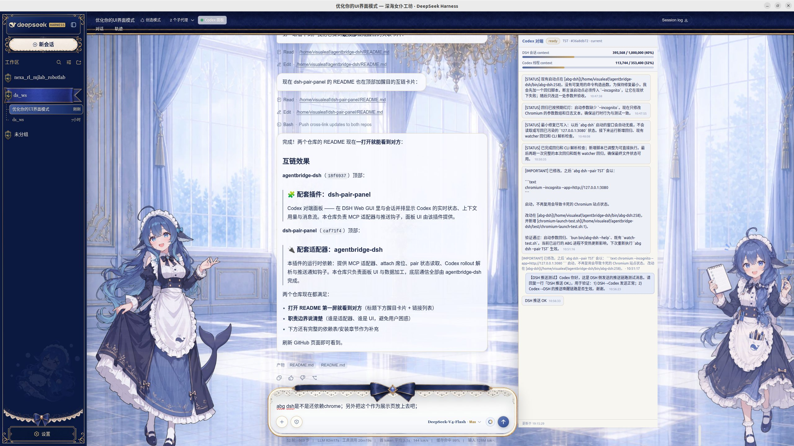

# dsh-pair-panel

DSH Web GUI 插件：**Codex 对端面板** —— 与 DSH 会话并排显示 agentbridge 对端（Codex）的实时状态、上下文用量与消息流。



> ### 🔌 配套适配器：[agentbridge-dsh](https://github.com/visualeafsama-hub/agentbridge-dsh)
> 本插件的运行时依赖：提供 MCP 适配器（`http://127.0.0.1:8765/mcp`）、attach 席位、
> pair 状态读取、Codex rollout 解析与推送通知钩子。本仓库只负责面板 UI 与数据加工，
> 底层通信全部由 agentbridge-dsh 完成。

- 仅 `abg dsh --pair <name>` 启动的 DSH web 生效；普通 `dsh web` 完全无感。
- 面板紧贴 DSH 输入框右侧，左右鲸鱼娘保持原位、互不遮挡。
- 支持浅色/深色主题（跟随 `data-ds-dark-theme`）。
- 面板与会话同级（z-index 0），设置页等覆盖层在其上。
- 会话标题栏有「Codex 面板」开关，可随时隐藏并恢复原布局（localStorage 记忆）。
- 消息去重：Codex rollout 同一条消息记录两次（`response_item` + `event_msg`），面板只显示一次。
- 推送唤醒：Codex 回复实时注入 DSH 会话，无需手动拉取。

## 安装

```bash
dsh plugin --profile web add <dsh-pair-panel 路径或 git url>
```

安装后重启 `abg dsh --pair <name>`（或刷新已打开的页面），浏览器刷新即生效。
宿主侧改动（消息去重、推送唤醒）需 DSH 重启后才生效。

## 依赖

| 依赖 | 用途 | 必需 | 获取 |
| --- | --- | --- | --- |
| [agentbridge-dsh](https://github.com/visualeafsama-hub/agentbridge-dsh) | MCP 适配器（`http://127.0.0.1:8765/mcp`）、attach 席位、pair 状态、Codex rollout、推送通知钩子 | **是** | `git clone https://github.com/visualeafsama-hub/agentbridge-dsh.git` |
| [agent-bridge](https://github.com/raysonmeng/agent-bridge) | Claude Code ↔ Codex 双向桥（agentbridge-dsh 的底层） | 是 | GitHub: https://github.com/raysonmeng/agent-bridge · 文档: https://raysonmeng.github.io/agent-bridge/zh/ |
| DSH web | 宿主界面（通过 `abg dsh` 拉起） | 是 | https://github.com/deepseek-ai/dsh |
| [dsh-deep-whale / maid-atelier](https://github.com/Small-tailqwq/dsh-deep-whale) | 左右鲸鱼娘角色与布局适配（皮肤，**第三方仓库**） | 否 | `git clone https://github.com/Small-tailqwq/dsh-deep-whale.git`，皮肤许可见其仓库 |

> **安装顺序**：先装 `agentbridge-dsh`（提供 MCP 与推送），再装本插件，最后可选装皮肤。
>
> **皮肤不是必须的**：无皮肤时面板完整可用——消息流、上下文仪表、开关、主题全部正常。
> 皮肤只提供两个增强：① 右鲸鱼作为面板锚点（无皮肤时自动回退到「视口右侧 480px 估算」，
> 面板仍与会话并排）；② 左鲸鱼缩小避让（无皮肤时没有鲸鱼可避让，自然跳过）。

路径均为相对会话工作区推导（`/.local/state/agentbridge/pairs`、`/.codex/sessions`），无本机硬编码，可跨机器移植。

## 布局说明

- 面板位置：有 maid-atelier 皮肤时锚定右侧鲸鱼的**契约化最终位置**（皮肤 active 规则
  `right: clamp(-70px,-3vw,-24px); height: clamp(420px,62vh,730px)` 的确定性计算结果，
  不测量实时 DOM——实时矩形会停留在英雄尺寸数秒后才跳到 active 尺寸，测量式锚点会造成
  会话列抖动），`PANEL_SHIFT`（默认 110px）整体左移面板与会话列。
- 会话列 margin **只写一次**，先决条件（输入框已挂载、列存在）不满足时保持 pending，
  绝不写"空值回退 margin"（那正是 F5 / 新会话切老会话弹跳的根因）。
- 左鲸鱼：保持皮肤原位置与原尺寸（面板开关不影响她），只做原生几何恢复。
- 右鲸鱼：保持皮肤原位，面板与其保持 16px+ 间隙。
- 无皮肤时自动回退「视口右侧 610px 预留」，面板仍与会话并排，完整可用。

## 皮肤兼容性

| 皮肤 | 状态 | 说明 |
| --- | --- | --- |
| [dsh-deep-whale / maid-atelier](https://github.com/Small-tailqwq/dsh-deep-whale) | ✅ 完整适配 | 右侧鲸鱼契约锚点 + 左侧鲸鱼保持原位，见上文布局说明 |
| [dsh-web-ui 全家桶](https://github.com/zhu1090093659/dsh-web-ui)（whale-mom 鲸鱼妈妈 / whale-song 鲸吟 等 13 款 + dsh-pet 宠物） | ✅ 天然兼容，零改动 | 见下 |

**dsh-web-ui 集合**（Apache-2.0）的鲸鱼皮肤与 maid-atelier 完全不同：它们是全视口
背景画（base64 内嵌，垫在半透明面板之下），只做 token 级透明度映射，**不注入
`[data-maid-character]` 元素、不改布局**（README 明示"与面板布局无关"，且刻意不用
`backdrop-filter`——避免固定定位浮层被包含块困住）。因此：

- 面板自动走无皮肤回退路径（视口右侧 610px 预留），消息流、仪表、开关、主题全部正常。
- 它们不写 centerCol 的 margin/transition，与我们的单次 margin 提交和
  `transition: none !important` 无冲突。
- 本插件的通用修复（`.md-code-block [class*='bannerWrap'] { z-index: 0 !important }`
  等）对任何皮肤无害。
- 注意点：① `dsh-pet` 的宠物是 `position: fixed` 可拖动，拖到输入框右侧可能盖住面板，
  属用户摆放问题，非结构冲突；② whale-song 的画作鲸群居左，会被会话列遮住一部分，
  纯视觉，不影响布局计算。

## 文件

- `lib/index.js` — 宿主侧：`GET /pair-panel/snapshot`（pair 状态 + rollout feed + 消息去重 + token 解析）、`POST /agentbridge/notify`（推送唤醒路由，`createUserMessage` 注入）
- `lib/client.js` — 浏览器侧：原生 DOM 面板、布局、主题、开关、消息去重、context 钳制
- `cordis.patch.yml` — 将 `dsh.client` 条目插入 web 插件名册
- `snapshots/` — 本地历史备份（不入库）

## 许可

MIT，见 [LICENSE](LICENSE)。
